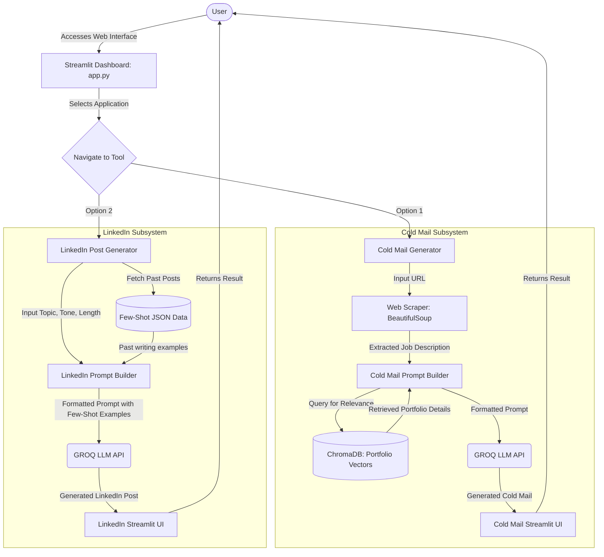
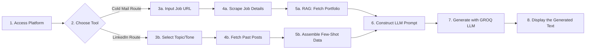
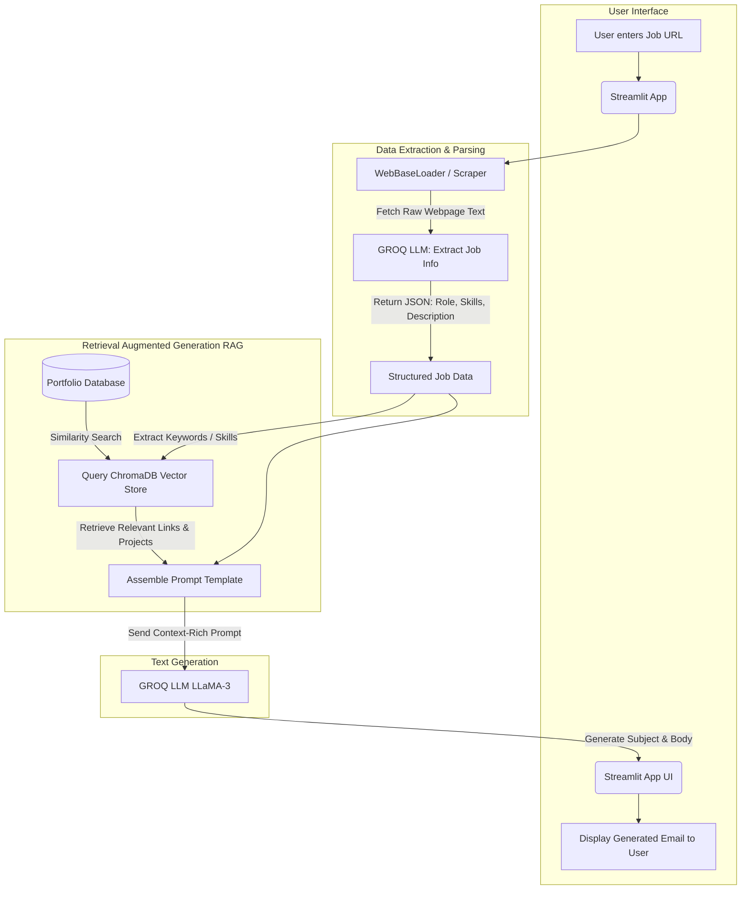
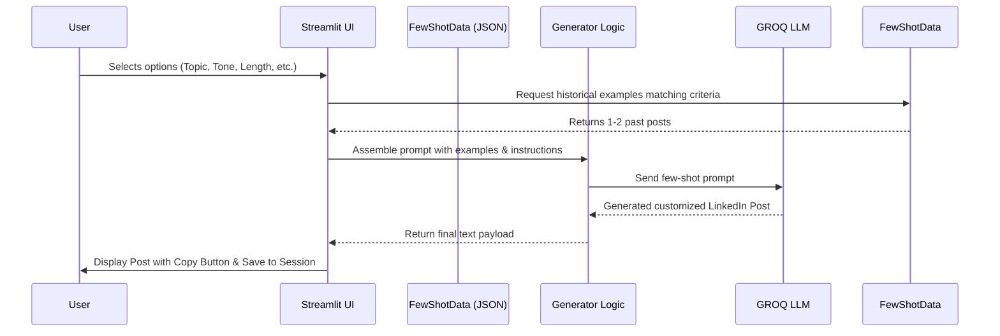

# 🚀 OutReachAI

**OutReachAI** is a comprehensive outreach automation platform combining two powerful generative AI tools: a **Cold Mail Generator** and a **LinkedIn Post Generator**. Built to streamline professional communication, it simplifies creating highly personalized cold outreach emails and engaging LinkedIn posts using Large Language Models (LLMs). The application provides an integrated dashboard powered by Streamlit, allowing seamless navigation between the tools, making it a perfect tool for job seekers, recruiters, business development executives, and LinkedIn influencers.

---

## 🏗 System Architecture & Workflow

The platform follows a centralized dashboard architecture, directing users to specific utility pages.

### System Architecture Diagram



### Simplified End-to-End Workflow
To understand the platform at a glance, here is the simplified step-by-step lifecycle of a user request:



---

## 🛠 Technical Overview

**Technologies & Frameworks Used:**
- **Language:** Python 3.9+
- **Frontend/Web App:** Streamlit
- **LLM Integrations:** LangChain, LangChain-Groq (Using GROQ API for high-speed LLM inference like LLaMA-3)
- **Vector Database:** ChromaDB (Local SQLite-backed embed DB for portfolio retrieval)
- **Data Manipulation:** Pandas, JSON
- **Web Scraping:** BeautifulSoup4
- **Environment Management:** python-dotenv

---

## 📝 Detailed Module Workflows

### 1. Dashboard (`app.py`)
The unified entry point of the project. It uses a customized Streamlit UI with a unique gradient background and hides the default sidebar to focus the user completely on the tool selection.
- **Workflow:** Renders a clean UI and displays two main options (Cold Mail Generator & LinkedIn Post Generator). Clicking on a button triggers Streamlit's `switch_page` function to redirect the user dynamically to the desired modular application.

### 2. Cold Mail Generator (`pages/1_Cold_Mail_Generator.py`)
This tool automates the process of writing personalized outreach emails to recruiters or potential clients.
- **Problem Statement:** A business development executive (e.g., from an IT services company) wants to reach out to a company (e.g., Nike) regarding an open Software Engineer position to offer dedicated services, or a job seeker wants to send a cold email regarding an open role.
- **Step-by-Step Workflow:**
  1. **User Input:** The user inserts the URL of an open job listing or careers page into the UI.
  2. **Data Scraping:** The application utilizes LangChain WebBaseLoader or BeautifulSoup4 to scrape the content and text from the provided job URL.
  3. **Data Parsing:** The text is passed to the LLM to structure and extract core job description information, skill requirements, and the role title.
  4. **Vector Search / RAG:** The extracted job requirements are used as a query against a local **ChromaDB** vector database. This database stores the user’s portfolio/company portfolio (projects, skills, links). ChromaDB returns the most relevant portfolio items that match the extracted job requirements.
  5. **Email Generation:** A structured prompt is created including the user persona, the scraped job description, and the retrieved portfolio assets. The prompt is sent to the **GROQ LLM**, requesting a concise, professional cold email.
  6. **Display:** The Streamlit UI displays the generated email on the screen for the user to review, copy, and send.

**Cold Mail Component Process Diagram**


### 3. LinkedIn Post Generator (`pages/2_LinkedIn_Post_Generator.py`)
This tool helps LinkedIn influencers or professionals generate posts that perfectly mimic their past writing style, tailored to new topics.
- **Problem Statement:** Consistently writing engaging LinkedIn posts is time-consuming. Users need a tool that writes new posts matching their historical voice, tone, and format preferences.
- **Step-by-Step Workflow:**
  1. **Data Ingestion & Preprocessing:** The user's past LinkedIn posts are processed, categorized by topics/tags, length (Short/Medium/Long), and language, and stored in a structured format (`processed_posts.json`).
  2. **User Input:** On the UI, the user selects a Topic, Length, Language, Tone (e.g., Professional, Humorous), Formatting Style (e.g., Bulleted list), and an optional custom base prompt.
  3. **Few-Shot Prompt Assembly:** Based on the filters chosen, the system fetches up to two historical posts from `processed_posts.json` that best match the criteria. These act as "few-shot examples" to explicitly guide the LLM's writing style.
  4. **Post Generation:** The custom prompt, constraints (topic, tone, length), and the few-shot examples are packaged securely by the backend and sent to the **GROQ LLM**.
  5. **Display & History Management:** The LLM generates the post and appends contextual trending hashtags. The generated text is immediately stored in the session state history and rendered in an interactive, collapsible Streamlit visual container allowing one-click copy-to-clipboard functionality.

**LinkedIn Post Component Process Diagram**


---

## ⚙️ Installation & Setup Details

### Prerequisites
- Python 3.9+ installed on your local machine.
- A **GROQ API Key**. Get yours from [Groq Console](https://console.groq.com/keys).

### Installation Steps

1. **Clone the Repository**
   Download or clone this project repository into your local machine and navigate into the root directory.

2. **Create a Virtual Environment**
   It's highly recommended to use a virtual environment to manage dependencies for a clean installation.
   ```bash
   python -m venv .venv
   ```
   **Activate the virtual environment:**
   - On Windows: `.venv\Scripts\activate`
   - On macOS/Linux: `source .venv/bin/activate`

3. **Install Dependencies**
   Run the following command in the root directory:
   ```bash
   pip install -r requirements.txt
   ```

4. **Environment Variables Configuration**
   In the root of the project, create a file named `.env`, and populate it with your GROQ API key.
   ```env
   GROQ_API_KEY=your_groq_api_key_here
   ```

5. **Run the Application**
   Launch the Streamlit server from the root directory.
   ```bash
   streamlit run app.py
   ```
   The platform will start locally. Access it via your web browser, normally at `http://localhost:8501`.

---

## 📈 Future Enhancements

- **Direct LinkedIn API Integration:** An ability to publish posts directly onto LinkedIn via the app via OAuth.
- **Gmail Automation Integration:** Connect the Gmail API to send generated cold emails natively over a click.
- **Automated Topic Extraction Models:** Utilize HuggingFace NLP pipelines to automatically bucket topics rather than rule-based tagging.
- **User Authentication:** Allow multi-tenant support where multiple users can securely upload their unique portfolios or post histories.

---
*© Developed for Final Year Project / Demonstration Purposes. Utilizes Codebasics references.*